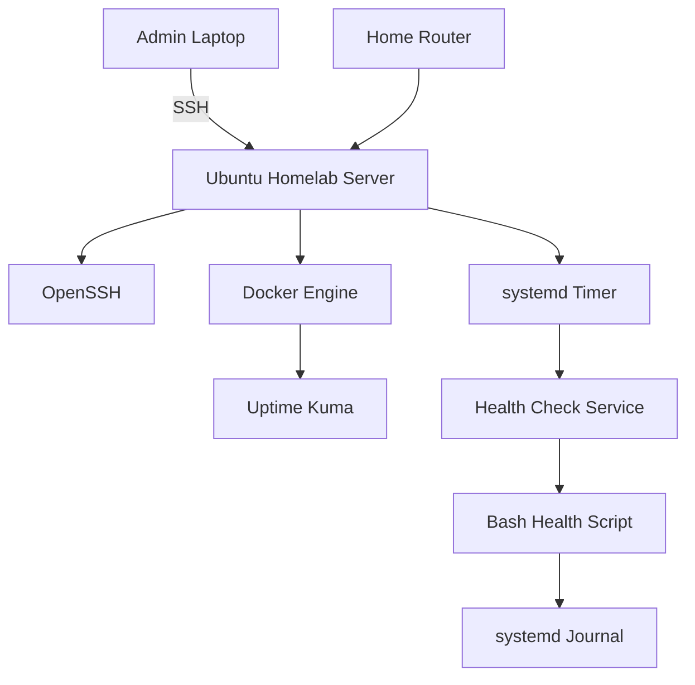
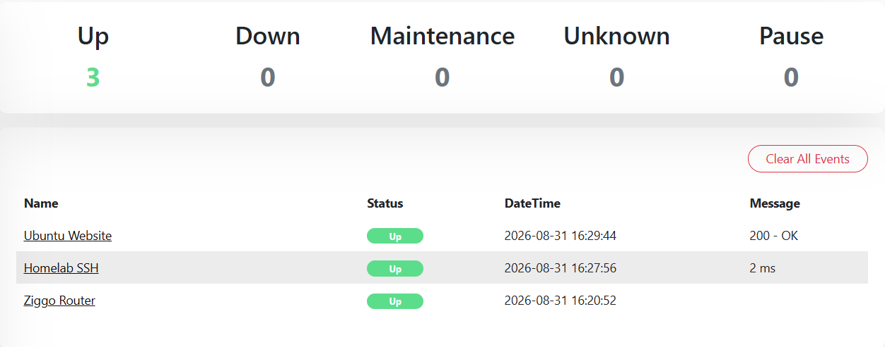
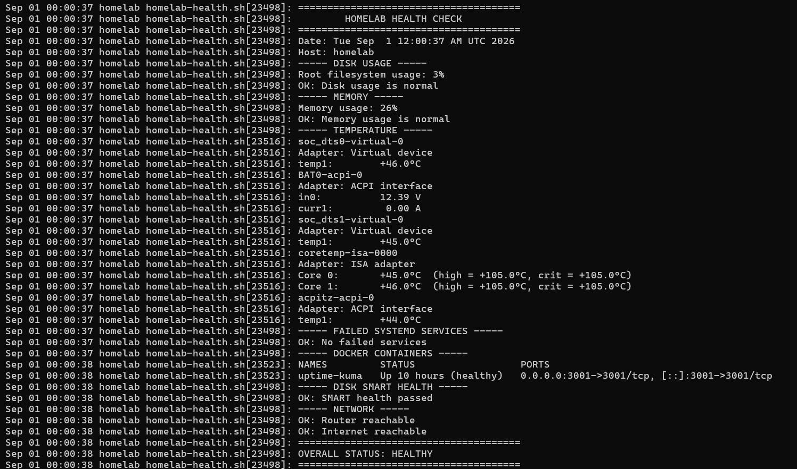

# Linux Homelab

A lightweight Ubuntu Server homelab built on repurposed laptop hardware to develop experience with Linux administration, networking, Docker, monitoring, automation, and troubleshooting.

The project is intentionally built on limited hardware to focus on practical infrastructure fundamentals.

## Current Setup

- Ubuntu Server 26.04 LTS
- Remote administration using OpenSSH
- SSH key-based authentication
- DHCP reservation for a stable LAN address
- UFW host firewall
- Docker Engine and Docker Compose
- Uptime Kuma for service monitoring
- Bash script for system health monitoring
- systemd service and timer automation
- SMART disk health monitoring
- Hardware temperature monitoring

## Architecture



## Services

### Uptime Kuma

Uptime Kuma runs as a Docker container and is used to monitor:

- Home router availability
- SSH availability on the server
- External HTTP/HTTPS connectivity

Docker Compose is used to define the container, persistent storage, port mapping, and restart policy.



## Automation

### Health Check

A Bash script performs a scheduled health check of the server, including:

- Disk and memory usage
- Hardware temperatures
- Failed systemd services
- Docker container status
- SMART disk health
- Router and Internet connectivity

The script is executed automatically using a systemd service and timer.

Results are stored in the systemd journal and can be viewed with:

```bash
journalctl -u homelab-health.service
```


## Networking

The server uses Ethernet and receives its address through DHCP, with a DHCP reservation configured on the router to provide a stable LAN address.

Docker creates separate bridge networks for containers, while published ports allow selected services to be accessed through the server's LAN address.

For example:
```bash 
LAN:              192.168.x.x
Docker bridge:    172.17.0.0/16
Compose network:  172.18.0.0/16
```

## Planned Improvements
- AdGuard Home for local DNS filtering
- Health-check notifications
- Backup and file-sharing services
- Additional Docker services
- Further networking and firewall configuration
